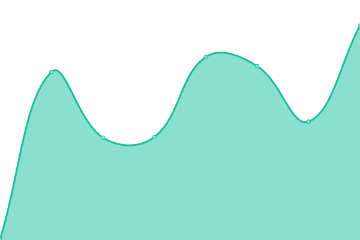
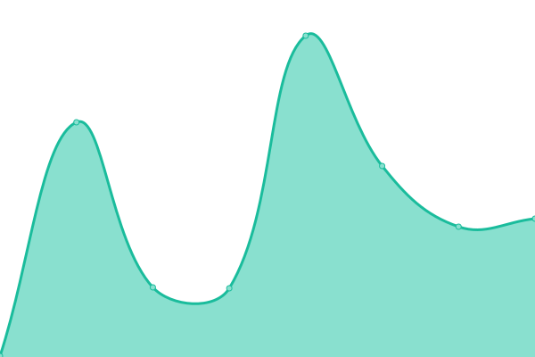
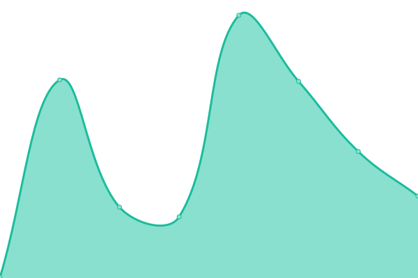
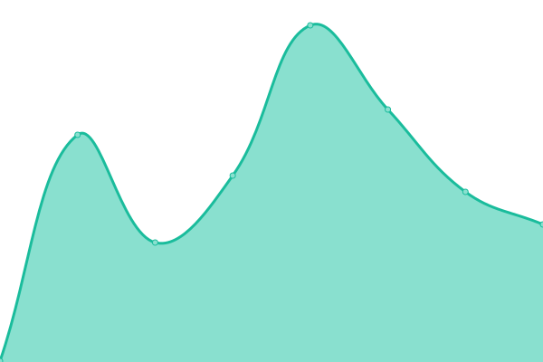
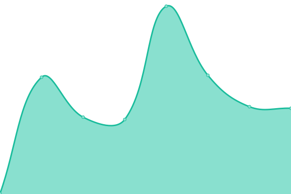
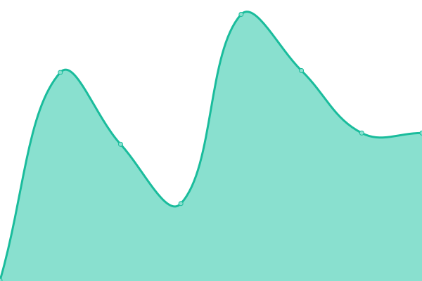

# [📈 Live Status](https://demo.upptime.js.org): <!--live status--> **🟩 All systems operational**

This repository contains the open-source uptime monitor and status page for [supertaptap](https://demo.upptime.js.org), powered by [Upptime](https://github.com/upptime/upptime).

With [Upptime](https://upptime.js.org), you can get your own unlimited and free uptime monitor and status page, powered entirely by a GitHub repository. We use [Issues](https://github.com/supertaptap/uptime/issues) as incident reports, [Actions](https://github.com/supertaptap/uptime/actions) as uptime monitors, and [Pages](https://demo.upptime.js.org) for the status page.

<!--start: status pages-->
<!-- This summary is generated by Upptime (https://github.com/upptime/upptime) -->
<!-- Do not edit this manually, your changes will be overwritten -->
<!-- prettier-ignore -->
| URL | Status | History | Response Time | Uptime |
| --- | ------ | ------- | ------------- | ------ |
|  [Landing TapTap](https://www.taptapapp.com) | 🟩 Up | [landing-tap-tap.yml](https://github.com/supertaptap/uptime/commits/HEAD/history/landing-tap-tap.yml) | 

 3062ms
     
 | 

<a href="https://supertaptap.github.io/uptime/history/landing-tap-tap">100.00%</a>
    

|  Customer | 🟩 Up | [customer.yml](https://github.com/supertaptap/uptime/commits/HEAD/history/customer.yml) | 

 263ms
     
 | 

<a href="https://supertaptap.github.io/uptime/history/customer">100.00%</a>
    

|  Product | 🟩 Up | [product.yml](https://github.com/supertaptap/uptime/commits/HEAD/history/product.yml) | 

 193ms
     
 | 

<a href="https://supertaptap.github.io/uptime/history/product">100.00%</a>
    

|  Order | 🟩 Up | [order.yml](https://github.com/supertaptap/uptime/commits/HEAD/history/order.yml) | 

 232ms
     
 | 

<a href="https://supertaptap.github.io/uptime/history/order">100.00%</a>
    

|  Payment | 🟩 Up | [payment.yml](https://github.com/supertaptap/uptime/commits/HEAD/history/payment.yml) | 

 333ms
     
 | 

<a href="https://supertaptap.github.io/uptime/history/payment">100.00%</a>
    

|  Benefit | 🟩 Up | [benefit.yml](https://github.com/supertaptap/uptime/commits/HEAD/history/benefit.yml) | 

 252ms
     
 | 

<a href="https://supertaptap.github.io/uptime/history/benefit">100.00%</a>
    

|  Family | 🟩 Up | [family.yml](https://github.com/supertaptap/uptime/commits/HEAD/history/family.yml) | 

 258ms
     
 | 

<a href="https://supertaptap.github.io/uptime/history/family">100.00%</a>
    

|  Location | 🟩 Up | [location.yml](https://github.com/supertaptap/uptime/commits/HEAD/history/location.yml) | 

 285ms
     
 | 

<a href="https://supertaptap.github.io/uptime/history/location">100.00%</a>
    

|  Recurrence | 🟩 Up | [recurrence.yml](https://github.com/supertaptap/uptime/commits/HEAD/history/recurrence.yml) | 

 252ms
     
 | 

<a href="https://supertaptap.github.io/uptime/history/recurrence">100.00%</a>
    

<!--end: status pages-->

[**Visit our status website →**](https://demo.upptime.js.org)

## 📄 License

- Powered by: [Upptime](https://github.com/upptime/upptime)
- Code: [MIT](./LICENSE) © [supertaptap](https://demo.upptime.js.org)
- Data in the `./history` directory: [Open Database License](https://opendatacommons.org/licenses/odbl/1-0/)
